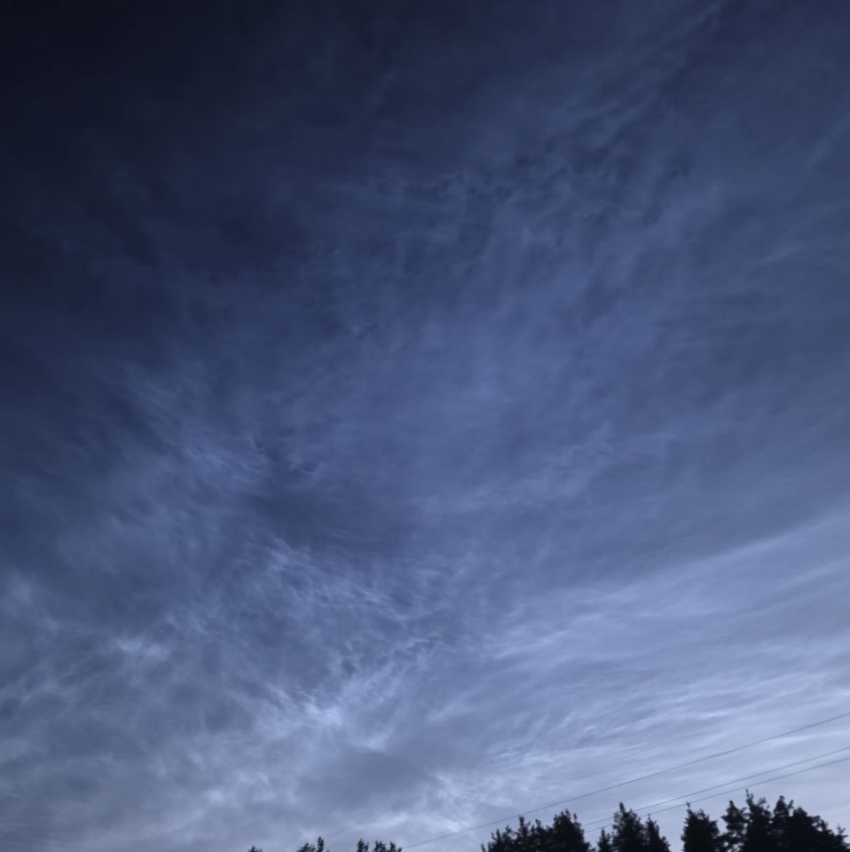
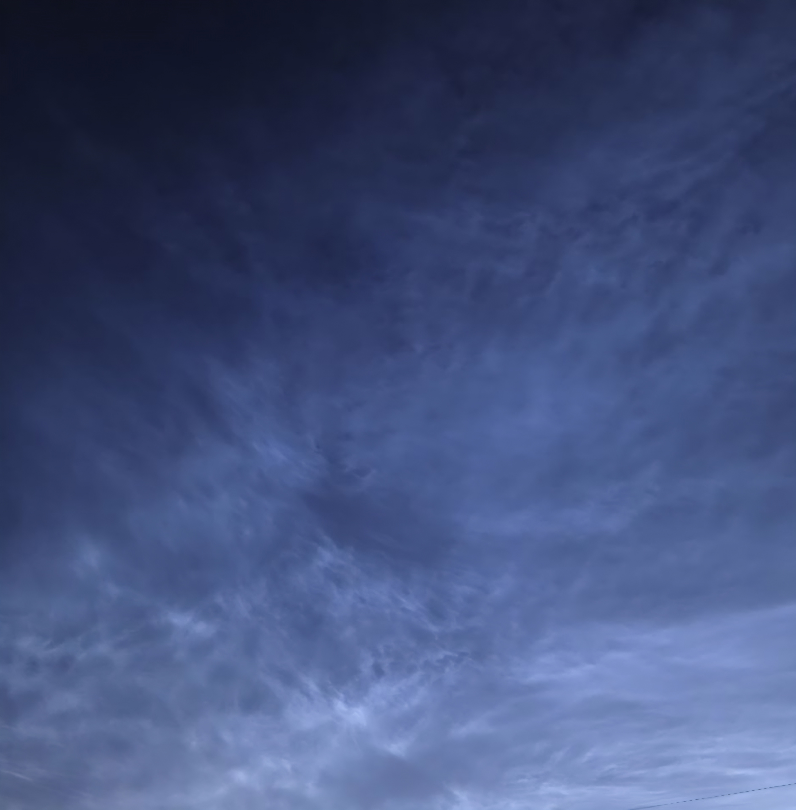
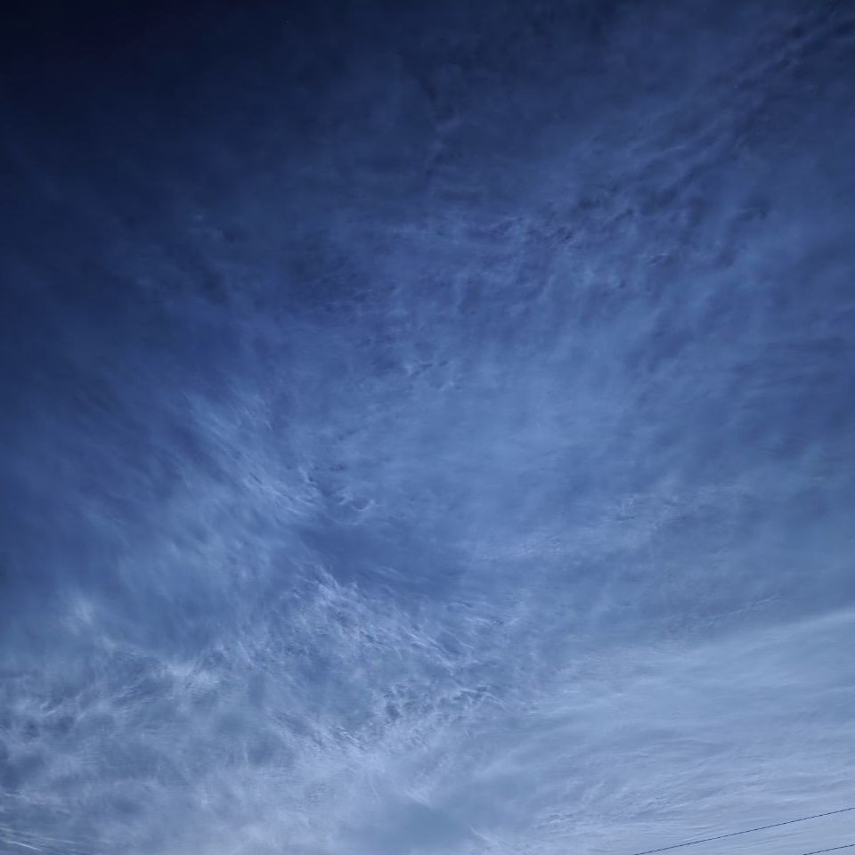

# Noctilucent Clouds

* **ID:** NS-P002
* **Date:** 18.07.26

## How the Phenomenon Occurs

**Noctilucent clouds** are the highest cloud formations in Earth's atmosphere. They form at an altitude of approximately **80–85 kilometers**, in the mesosphere.

During summer, temperatures in the mesosphere at these altitudes can drop to around **−120 °C**. Under these conditions, water vapor can condense onto tiny particles of dust and other aerosols, forming microscopic ice crystals.

When the Sun is already below the horizon for an observer on Earth's surface, its rays can still illuminate these high-altitude clouds. As a result, against an already dark or twilight sky, they appear as thin, **silvery-blue structures**.

This is why noctilucent clouds are particularly noticeable during summer: the surface of Earth is already in darkness, while the mesosphere at high altitudes is still illuminated by the Sun.

© NESTIMS
